# Breeze AI Copilot

Breeze AI is an intelligent, multi-agent copilot designed to provide end-to-end assistance across CRM workflows. It integrates with Pipedrive to assist with sales, marketing, and service tasks, leveraging Retrieval-Augmented Generation (RAG) for querying data and a powerful language model for content creation and task execution.

## Key Features

* **Multi-Agent Architecture**: A supervisor agent routes tasks to specialized agents for Sales, Marketing, and Customer Service, ensuring expert handling of every request.
* **RAG-Powered CRM Q&A**: Instantly get answers about your CRM deals. The system ingests data into a Pinecone vector store for fast and accurate semantic search.
* **CRM Actions & Automation**: Go beyond just asking questions. Create notes on deals and update deal statuses directly from the copilot interface.
* **Content Generation**:
  * **Marketing**: Draft blog post outlines and marketing emails.
  * **Service**: Write polite and helpful responses to customer queries.
* **Proactive AI Enrichment**: A webhook server listens for new deals in Pipedrive, automatically triggering an AI agent to research the associated company and enrich the deal with key insights.
* **Multiple Interfaces**:
  * A user-friendly **Gradio Web UI** for interactive chat.
  * A **Command-Line Interface (CLI)** for multi-agent interaction.
  * A dedicated CLI for direct RAG Q&A.

## System Architecture & Flowchart

The Breeze AI Copilot operates on a supervised, multi-agent architecture. A central **Supervisor** analyzes the user's request and routes it to the most appropriate agent. Each agent is equipped with a specific set of tools to perform its tasks.

```mermaid
graph TD
    subgraph User Interfaces
        UI[🌐 Gradio Web App]
        CLI[💻 Command Line]
        WH[🔌 Pipedrive Webhook]
    end

    subgraph Core Logic
        SUP[🤖 Supervisor Agent]
        SA[🧑‍💼 Sales Agent]
        MA[🎨 Marketing Agent]
        SE[👥 Service Agent]
    end

    subgraph Tools & Services
        subgraph Pipedrive Tools
            RAG[🔎 CRM RAG Tool]
            NOTE[📝 Create Note Tool]
            STAT[🔄 Update Status Tool]
        end
        subgraph Generative Tools
            BLOG[📄 Blog Outline Tool]
            EMAIL[✉️ Marketing Email Tool]
            RESP[💬 Customer Response Tool]
        end
        subgraph Enrichment Tools
            RES[🔬 Company Research Tool]
        end
    end

    subgraph External Systems
        CRM[(Pipedrive CRM)]
        VDB[(Pinecone Vector DB)]
        LLM[(Nebius AI LLM)]
    end

    %% Connections
    UI --> SUP;
    CLI --> SUP;
    WH --> SUP;

    SUP -->|Routes Request| SA;
    SUP -->|Routes Request| MA;
    SUP -->|Routes Request| SE;
    WH -->|"Proactive Task"| SA;

    SA --> RAG;
    SA --> NOTE;
    SA --> STAT;
    SA --> RES;

    MA --> BLOG;
    MA --> EMAIL;
  
    SE --> RAG;
    SE --> RESP;

    RAG --> VDB;
    NOTE --> CRM;
    STAT --> CRM;
  
    RAG --> LLM;
    BLOG --> LLM;
    EMAIL --> LLM;
    RESP --> LLM;
    RES --> LLM;

```



## Setup and Installation

Follow these steps to set up and run the Breeze AI Copilot on your local machine.

### 1. Clone the Repository

```bash
git clone https://github.com/sachin62025/breeze-ai-copilot.git
cd breeze-ai-copilot
```

### 2. Create a Virtual Environment

It is highly recommended to use a virtual environment to manage dependencies.

```bash
python -m venv venv
source venv\Scripts\activate
```

### 3. Install Dependencies

Install all the required Python libraries from the `requirements.txt` file.

```bash
pip install -r requirements.txt
```

### 4. Configure Environment Variables

Create a file named `.env` in the root of the project directory. Copy the contents of the example below and fill in your credentials.

**.env file:**

```env
# --- LLM Configuration ---
NEBIUS_API_KEY="your_nebius_api_key"
NEBIUS_API_BASE="your_nebius_api_base_url"

# --- Vector DB Configuration ---
PINECONE_API_KEY="your_pinecone_api_key"
PINECONE_INDEX_NAME="your-chosen-pinecone-index-name"

# --- CRM Configuration ---
PIPEDRIVE_API_TOKEN="your_pipedrive_api_token"
PIPEDRIVE_COMPANY_DOMAIN="your-company-domain"  
```

## Running the Application

### Step 1: Ingest CRM Data

Before you can ask questions about your deals, you need to load them into the Pinecone vector store. The `ingest_data.py` script fetches recent deals from Pipedrive, formats them, and stores their vector embeddings.

Run the ingestion script from the root directory:

```bash
python ingest_data.py
```

### Step 2: Choose Your Interface

You can interact with the copilot in several ways.

#### A) Gradio Web UI (Recommended)

This launches a user-friendly chat interface in your browser.

```bash
python app.py
```

Navigate to the local URL provided in the terminal (e.g., `http://127.0.0.1:7860`).

#### B) Multi-Agent CLI

Interact with the full multi-agent system directly from your terminal.

```bash
python main.py
```


## Testing the Connection

You can test your Pipedrive API connection directly by running the `test.py` script. This will attempt to add a test note to **Deal ID 3** in your Pipedrive account.

```bash
python test.py
```

Check Pipedrive to see if the note was added successfully.

## Project Structure Overview

```
.
├── .env  
├── .gitignore  
├── app.py  
├── ask_copilot.py  
├── ingest_data.py  
├── main.py   
├── requirements.txt  
├── test.py   
├── webhook_server.py   
└── src/  
    ├── agents/   
    │   ├── marketing_agent.py
    │   ├── sales_agent.py
    │   └── service_agent.py
    ├── tools/  
    │   ├── crm_tools.py
    │   ├── enrichment_tools.py
    │   └── generative_tools.py
    ├── config.py   
    ├── crm_connector.py  
    ├── embedding_client.py 
    ├── llm_connector.py  
    ├── rag_chain.py  
    ├── supervisor.py   
    └── vector_store_connector.py 
```
